[뒤로가기](../../README.md) 

# SpringBoot 기본 프로젝트

## 프로젝트 환경

1. [Visual Studio Code](https://code.visualstudio.com/)
2. VSCode Extension
   - Java Extension Pack
   - Spring Boot Extension Pack
3. JDK : [Red Hat OpenJDK 17.0.6.0](https://developers.redhat.com/products/openjdk/download#assembly-field-downloads-page-content-82031)
4. SpringBoot
   - Version : 2.7.14
   - Build : Gradle
   - Library : Spring Web

## 시작

Gradle 프로젝트를 생성하고 실행한다.

### (1) SpringBoot 프로젝트 생성

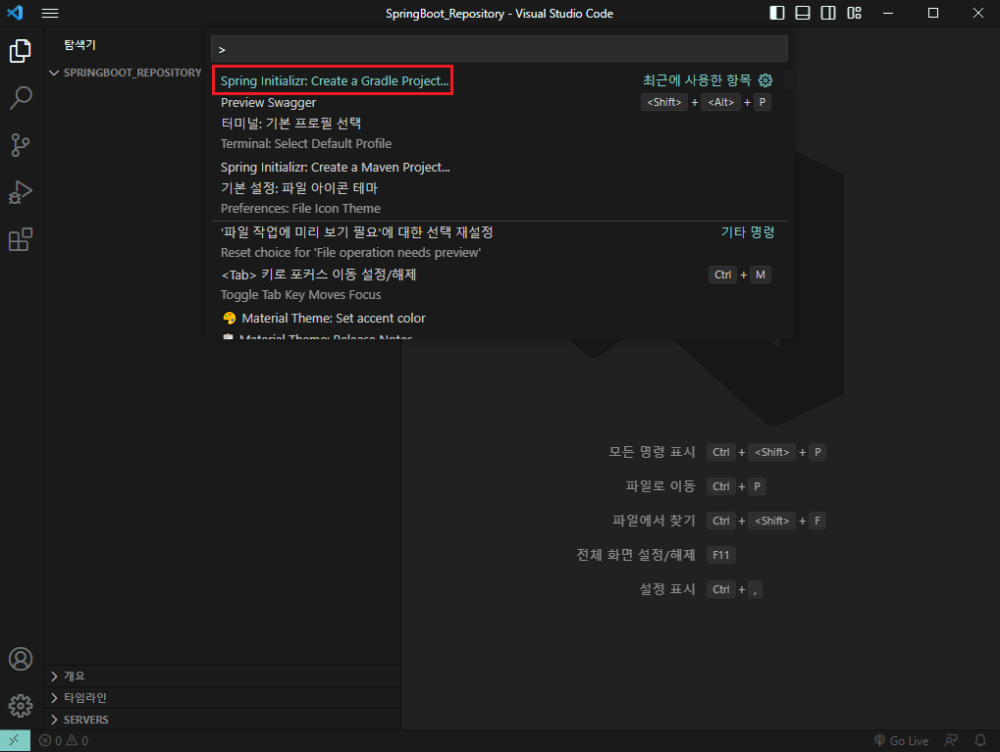

VScode를 켠뒤 [ctrl + shift + p] 동시에 눌러 명령 팔레트를 연다. 
Spring Initializr: Create a Gradle Project를 선택한뒤 엔터한다. 

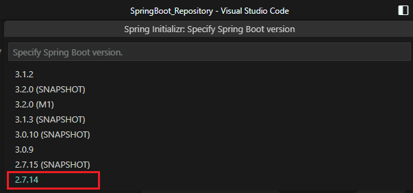 
SpringBoot의 버전을 선택할 수 있다. 
2.7.14로 선택한다. 

### [주의사항]

SpringBoot의 버전에 따라 추가하는 라이브러리의 Dependency의 설정이나 버전이 달라진다. 
해당 문서는 모든 SpringBoot의 프로젝트 버전을 2.7.14로 통일한다. 

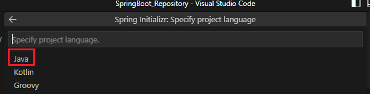 
Java를 선택한다. 

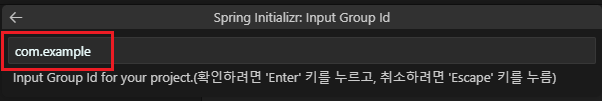 
엔터한다. 

Groupid는 프로젝트의 식별자이다. 
그래서 만약 프로젝트가 분산되어 있으면 
부모의 Groudid를 통해 새 식별자를 추가하면서 모듈화한다. 

예시) com.example.demo1, com.example.demo2, com.example.demo3

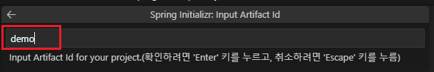 
엔터한다. 

Artifactid는 프로젝트의 버전 정보를 뺀 jar파일 이름이다. 

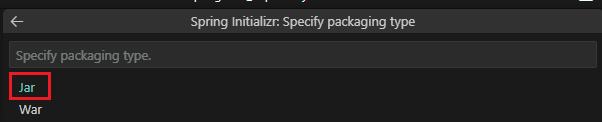 
빌드 방식을 선택할 수 있다. 
jar로 한다. 

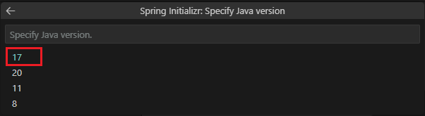 
Java 버전을 선택한다.
17로 한다.

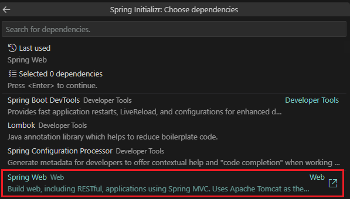 
초기에 SpringBoot의 라이브러리 Dependency를 설정할 수 있다. 
Spring Web을 엔터하고 다시 엔터한다. 

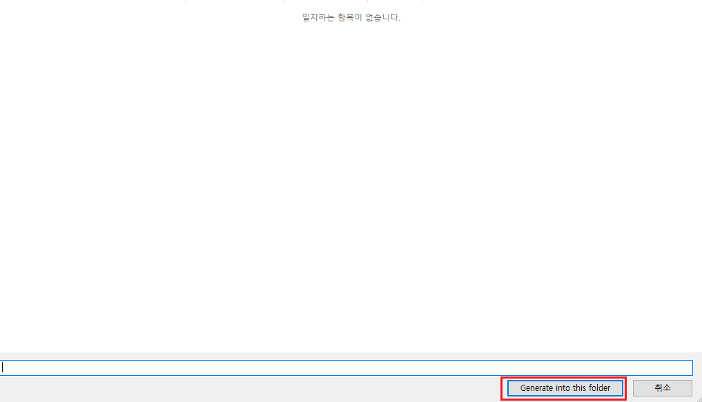 
프로젝트를 생성할 위치를 선택한뒤 생성한다.

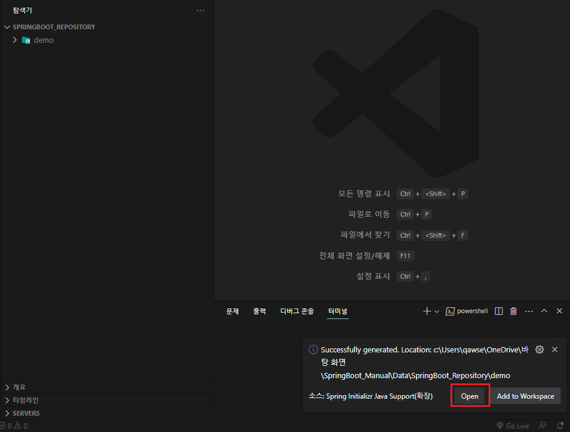 
다음과 같이 알림이 뜨면 Open을 누른다.

### (2) 프로젝트 실행

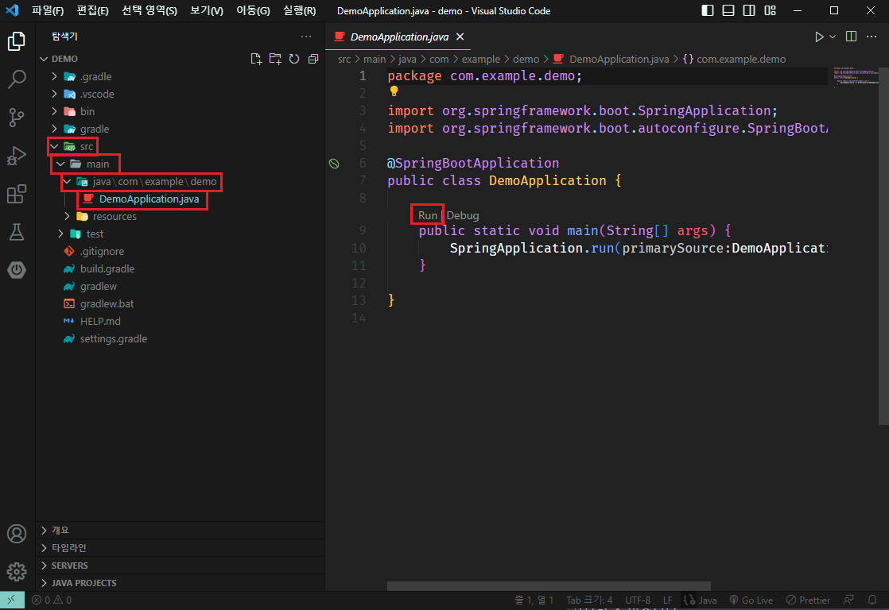 
src/main/java/com/example/demo로 이동해 DemoApplication.java를 연다. 
Spring Boot의 구성이 완료되면 자동으로 Run | Debug 버튼이 생긴다. 
Run을 누른다. 

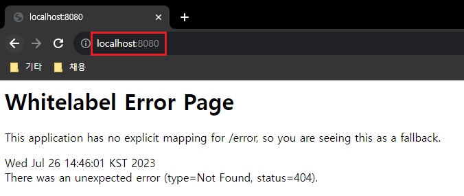 

> http://localhost:8080/

웹에서 해당 URL로 접속한다. 

### (3) Gradle 빌드

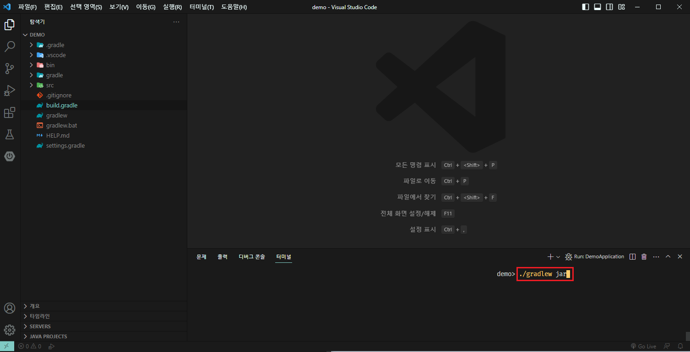 

프로젝트 경로에서 

> ./gradlew jar

입력해 빌드를 진행한다. 

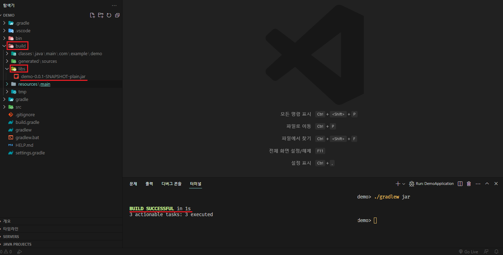 

빌드가 완료되면 build폴더가 새로 생기며 build/lib 폴더에
jar파일이 생성된다. 

추가적으로,

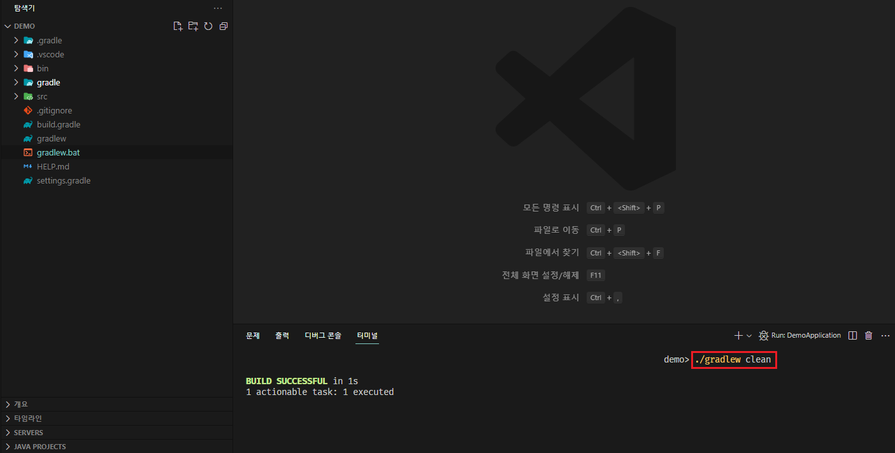 

> ./gradlew clean

빌드 환경 구성을 초기화할 수 있다. 
build폴더가 삭제된것을 볼 수 있다. 

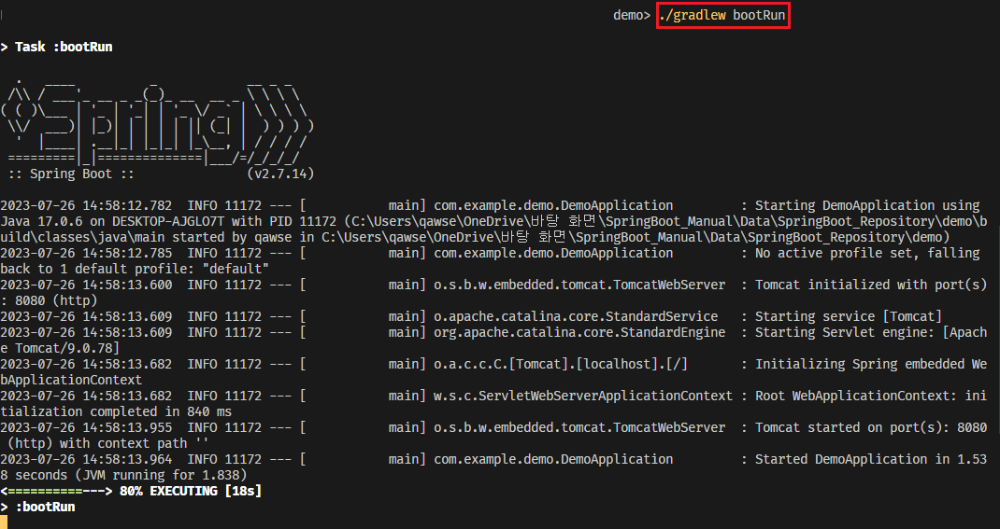 

> ./gradlew bootRun

해당 명령어로 빌드를 진행한뒤 빌드된 jar파일을 바로 실행하는것도 가능하다. 

> http://localhost:8080/

웹에서 해당 URL로 접속하며 서버가 배포된것을 확인할 수 있다. 
