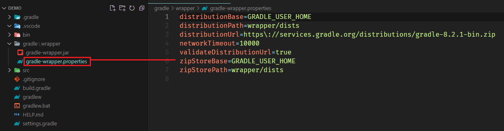
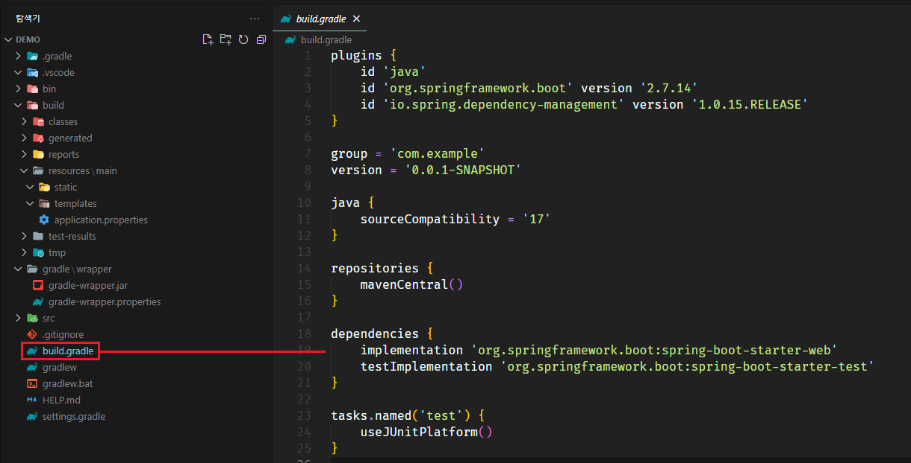

[뒤로가기](../../README.md) 

# Gradle

java 기반 프로젝트를 빌드하고 Dependency를 관리하는 오픈 소스 빌드 자동화 도구이다.

### Gradle-Wrapper

서버를 개발할때 개발자마다 각자 다른 버전의 gradle을 사용할 때 버전이 맞지 않아 빌드가 불가능 할 수 있다. 
그래서 gralde wrapper가 등장했다. 
gradle wrapper는 각자 다른 개발 환경에서도 기본으로 설치된 gradle의 버전과 상관없이 
프로젝트에 종속된 gradle 버전으로 빌드를 할 수 있다. 

 

다음과 같이 

> distributionUrl=https\://services.gradle.org/distributions/gradle-8.2.1-bin.zip

distributionUrl에 URL 형태로 해당 프로젝트의 Gradle 버전이 생성되었다. 
해당 URL를 통해 다른 개발자가 이 프로젝트를 받아서 바로 사용할 수 있게 된다. 

예시) 
A 개발자가 현재 프로젝트에서 gradle wrapper를 실행한다. 
B 개발자가 해당 프로젝트를 ./gradlew build를 진행한다. 
B 개발자의 개발 환경의 gradle 버전이 달라도 gradlew(gradle wrapper)덕분에 빌드가 가능하다. 

그래서, Gradle 빌드에 권장되는 사용 방법은 Gradle Wrapper 이다. 

### build.gradle

프로젝트의 빌드 설정을 포함하며 실제로 빌드를 진행시 사용되는 Gradle 빌드 스크립트이다.

 

plugins : Springboot의 플러그인을 설정하고 버전을 지정한다. 

group : 프로젝트의 그룹 ID을 지정한다. 

version : 프로젝트 버전을 명시할 수 있다. 

java : java의 구성 옵션을 설정한다. 
sourceCompatibility는 소스 코드의 호환 버전을 설정한다. 

repositories : dependencies에 지정된 라이브러리를 가져올 저장소를 지정한다.

dependencies : 프로젝트에서 사용되는 라이브러리의 Dependency를 설정한다. 
그래서 외부라이브러리를 사용할때 해당 위치에 Dependency를 지정하면
사용할 수 있다. 

tasks.named('test') : Gradle의 테스트 태스크를 구성한다.

useJUnitPlatform()는 JUnit5를 테스트 실행에서 사용하도록 한다. 
JUnit5는 Java언어를 위한 테스팅 프레임워크이다. 

### [gradlew 명령어]

./gradlew build : 일반적인 프로젝트 빌드를 진행한다.

./gradlew build -x test : 프로젝트의 테스트를 건너뛰고 빌드를 진행한다.

./gradlew test : 빌드를 하기전 빌드가 가능한지 테스트를 진행한다.

./gradlew bootRun : 빌드를 한뒤 앱을 실행한다.

./gradlew wrap : gradle-wrapper.jar를 생성한다.
