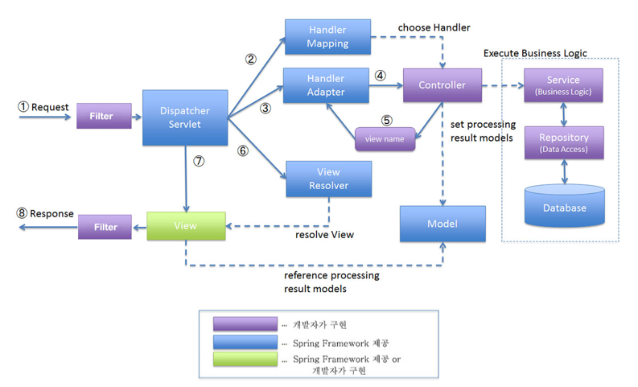

[뒤로가기](../../README.md)<br>

# SpringBoot 서비스 구조

## MVC 패턴

Model, View, Controller의 줄인말로 앱을 구성할때 구성요소를 3가지로 구분한 패턴<br>

[SpringBoot MVC 패턴]<br>
<br>

### (1)

클라이언트 요청(Request)을 받으면 DispatcherServlet이 요청을 받아<br>
해당 요청에 대한 URI를 Handler Mapping에게 보내 매핑이 가능한 (핸들러)Controller를 식별하도록 한다.<br>

### (2)

Handler Mapping은 요청에 대한 반환값을 DispatcherServlet에게 값을 보낸다.<br>

### (3)

반환값을 받은 DispatcherServlet은 매핑된 Controller에게
비즈니스 로직을 수행하도록 요청한다.<br>
(핸들러 어댑터가 실제로 수행을 요청한다.)<br>

### [비즈니스 로직 수행 과정]

```
controller <-DTO-> Service <-Entity-> DAO(Repository) <-Entity-> DB
                      |                 |
                  ServiceImpl        DAOImpl
```

Controller : Model과 View 사이의 브릿지 역할 수행<br>
(클라이언트의 모든 요청은 Controller를 통해 진행)<br>

DTO : 계층간의 데이터 교환을 위한 객체<br>

Service : Controller에게 받은 요청에 대한 비즈니스 로직을 수행<br>
(실제 요청에 대한 처리를 담당)<br>

Entity : DB에 쓰일 컬럼과 실제 데이터간의 연관 관계를 정의<br>
(실제 DB의 테이블과 1:1로 매핑되는 객체)<br>

Repository : Entity에 의해 생성된 DB에 접근하는 메소드를 사용하기 위한 인터페이스<br> (Service와 DB를 연결하는 고리의 역할을 수행)<br>

DAO : DB에 접근하는 객체를 의미<br> (Service가 DB에 연결할 수 있게 해주는 역할)<br>

### (4)

Service를 통해 요청을 수행한뒤 다시 Controller에게 처리 결과를 보내면<br>
DispatcherServlet은 특정 핸들러 메서드를 호출하고 핸들러 메서드는<br>
Model과 View를 반환하게 된다.<br>

### (5)

그리고 논리적 View인 View Resolver를 호출하고,<br>
View Resolver는 View의 논리 이름을 물리 이름으로 변경하고 렌더링을 <br>담당하는 View 객체를 DispatcherServlet에게 반환한다.<br>

### (6)

최종적으로 DispatcherServlet은 반환받은 View객체를 View에게 보내 응답하게 된다.<br>

---

간략한 동작 순서이다.

1. 핸들러 조회 : 핸들러 매핑을 통해 요청 URL에 매핑된 핸들러(컨트롤러)를 조회한다.
2. 핸들러 어댑터 조회 : 핸들러를 실행할 수 있는 핸들러 어댑터를 조회한다.
3. 핸들러 어댑터 실행 : 핸들러 어댑터를 실행한다.
4. 핸들러 실행 : 핸들러 어댑터가 실제 핸들러를 실행한다.
5. ModelAndView 반환 : 핸들러 어댑터는 핸들러가 반환하는 정보를 ModelAndView로 변환해서 반환한다.
6. View Resolver 호출 : View Resolver를 찾아 실행한다.
7. View반환 : View Resolver는 View의 논리이름을 물리이름으로 바꾸고, 렌더링 역할을 담당하는 View 객체를 반환한다.
8. View 렌더링 : View를 통해서 View를 렌더링한다.
