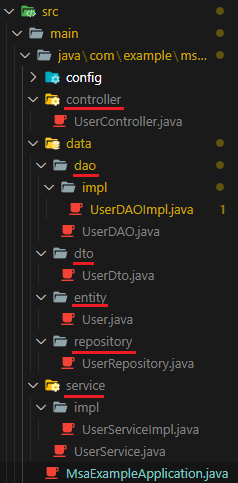
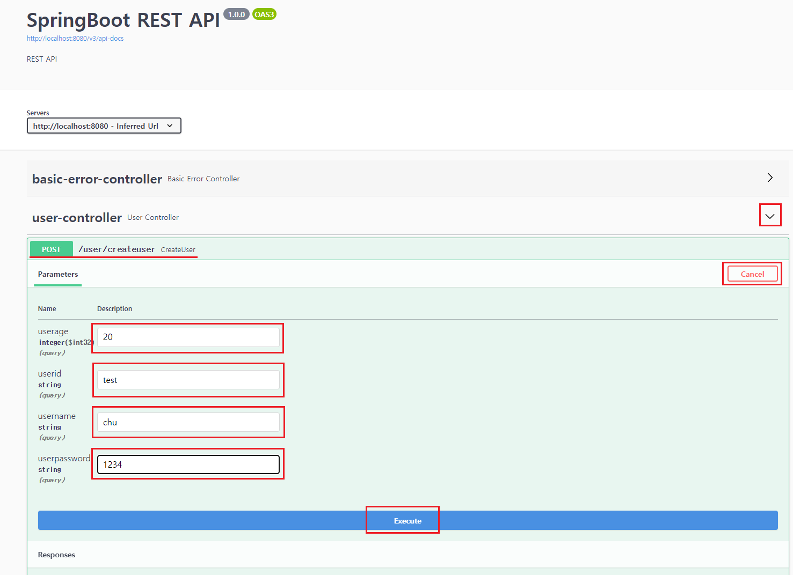
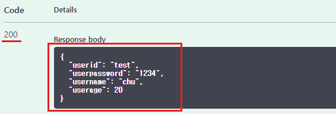
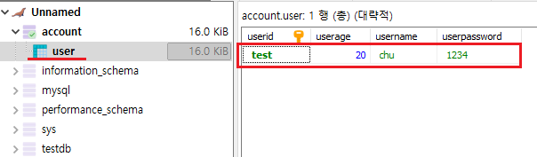

[뒤로가기](../../README.md)<br>

# MVC 서비스 구조 예시

### 프로젝트 예시는 SpringBoot_Repository/msa-example 프로젝트이다.

## 프로젝트 환경

1. [Visual Studio Code](https://code.visualstudio.com/)
2. VSCode Extension
   - Java Extension Pack
   - Spring Boot Extension Pack
3. JDK : [Red Hat OpenJDK 17.0.6.0](https://developers.redhat.com/products/openjdk/download#assembly-field-downloads-page-content-82031)
4. SpringBoot
   - Version : 2.7.14
   - Build : Gradle
   - Library : Spring Web, SpringBoot DevTools, LomBok, Spring Data JPA, MariaDB Driver, Swagger=3.0.0
   - DataBase : MariaDB

## 시작

```
controller <-DTO-> Service <-Entity-> DAO(Repository) <-Entity-> DB
                      |                 |
                  ServiceImpl        DAOImpl
```



이 예시는 어디까지나 서비스가 어떻게 구성되는지만을 설명한다.<br>
그래서 각 기능에 코드의 세부적인 내용은 생략한다.<br>
세부적인 내용은 각 기능별 문서에 있다.<br>

서비스 예시는 회원가입과 유저조회 기능이다.

## Controller [UserController]

```
controller
```

---

```
private final UserService userService;

@Autowired
public UserController(UserService userService){
    this.userService = userService;
}
```

Controller를 통해 요청을 받기전<br>
서비스를 구성하면서 실제 비즈니스 로직을 수행하는 UserService를 호출하기위해 UserService클래스 변수를 생성한다.<br>

```
@PostMapping(value = "/user/createuser")
public ResponseEntity<UserDto> CreateUser(@Validated @RequestBody UserDto userDto) {
    String userid = userDto.getUserid();
    String userpassword = userDto.getUserpassword();
    String username = userDto.getUsername();
    int userage = userDto.getUserage();

    UserDto res = userService.CreateUser(userid, userpassword, username, userage);

    return ResponseEntity.status(HttpStatus.OK).body(res);
    }
```

실제 요청을 받을때 응답하는 메서드이다.<br>
회원가입 요청 URL(/user/createuser)를 받을 경우<br>
요청받을때 전달받은 데이터를 DTO로 변환한뒤 UserService에게 실제 회원가입 비즈니스를 요청한다.<br>
비즈니스 수행이 완료되면 HTTP 상태 코드 200(요청 성공)과 유저 데이터를 반환한다.<br>

## DTO [UserDto]

```
controller <-DTO->
```

---

```
public class UserDto {

    private String userid;
    private String userpassword;
    private String username;
    private int userage;

    public User toEntity()
    {
        return User.builder()
        .userid(userid)
        .userpassword(userpassword)
        .username(username)
        .userage(userage)
        .build();
    }
}
```

실제 서비스에서 비즈니스 로직을 수행하기위해 클라이언트에서 전달 받은 데이터를 DTO로 전달받는다.<br>
또한, DTO 데이터를 Entity로 변환하는 메서드를 제공한다.<br>

### [DTO를 쓰는 이유]

DTO는 클라이언트와 통신하며 데이터를 교환한다.<br>
만약, DTO가 아닌 Entity를 통해서만 데이터를 교환할때<br>
클라이언트의 데이터 요청이 변경될 경우 실제 DB 데이터간에 강한 결합으로<br>
변경시마다 Entity의 코드를 변경해야한다.<br> (Model과 View의 강한 결합)<br>
또한, Entity의 데이터가 외부에 노출되어 보안상에도 안좋다.<br>

결론적으로 실제 DB와 데이터를 교환하는 객체와 클라이언트 요청시 전달받는 객체와의
역할 분리를 위해 사용한다.<br>
그래서 DTO 데이터를 Entity로 변환하는 메서드가 있는것이다.<br>
이 메서드를 통해 클라이언트가 원하는 데이터만 뽑아 전달할 수 있기에 변경에도 간편한다.<br>

## Service [UserService, UserServiceImpl]

```
controller <-DTO-> Service
                      |
                  ServiceImpl
```

---

```
UserDAO userDAO;

@Autowired
public UserServiceImpl(UserDAO userDAO){
    this.userDAO = userDAO;
    }
```

DB와의 데이터 교환을 위한 DAO를 호출하기 위해 DAO 변수를 생성한다.

```
@Override
public UserDto CreateUser(String userid, String password, String username, int userage) {
    User user = new User(userid, password, username, userage);

    userDAO.CreateUser(user);

    UserDto userDto = new UserDto(user.getUserid(), user.getUserpassword(),user.getUsername(), user.getUserage());
    return userDto;
    }
```

실제로 회원가입을 수행하는 코드이다.<br>
DAO의 CreateUser를 호출해 DB에 데이터 저장을 요청하게 된다.<br>
여기서 DTO를 통해 전달받은 데이터값에 대한 Entity 변환을 수행한다.<br>
(원하는 데이터값으로 변환할 수 있다.)<br>

### [인터페이스를 쓰는 이유]

보통 메서드의 인터페이스를 쓰는 이유는 실제 메서드들에 대한 분리를 위해서이다.<br>
인터페이스와 메서드 분리를 통해 독립적으로 확장하고 메서드의 변경이 있어도 서비스에 영향을 주지 않는다.<br>
객체 지향의 특징중 다형성과 OCP원칙을 준수하는 설계 방식이다.<br>
하지만 실제로는 인터페이스와 메서드간의 1대1관계로 구현되기에 관습적으로 사용한다.<br>

## Entity [User]

```
controller <-DTO-> Service <-Entity->
                      |
                  ServiceImpl
```

---

```
@Table(name = "user")
public class User {
    @Id
    String userid;

    String userpassword;

    String username;

    Integer userage;

    public UserDto toDto()
    {
        return UserDto.builder()
        .userid(userid)
        .userpassword(userpassword)
        .username(username)
        .userage(userage)
        .build();
    }
}
```

실제 DB 테이블의 데이터간의 연동을 위한 객체이다.<br>
그래서 Table어노테이션을 통해 테이블 user가 작성된다.<br>
또한, 다시 DTO로 변환하기 위한 메서드도 있다.<br>

## DAO(Repository) [UserDAO, UserDAOImpl, UserRepository]

```
controller <-DTO-> Service <-Entity-> DAO(Repository)
                      |                 |
                  ServiceImpl        DAOImpl
```

---

### UserRepository

```
public interface UserRepository extends JpaRepository<User, String>{

}
```

DB에 접근하기 위한 인터페이스이다.<br>
여기서는 JPA를 사용하여 CRUD(Create, Read, Update, Delete)를 수행한다.<br>

### UserDAOImpl

```
UserRepository userRepository;

@Autowired
public UserDAOImpl(UserRepository userRepository){
        this.userRepository = userRepository;
    }
```

인터페이스로 지정된 UserRepository의 기능을 사용하기위해 userRepository변수를 생성한다.<br>

```
@Override
public User CreateUser(User user) {
        userRepository.save(user);
        return user;
    }
```

실제 DB에 save(Create)요청을 하며 DB에 접근하게된다.
(JPA의 save메서드)<br>
데이터를 보낼때도 Entity 객체로 보낸다.<br>

## DB

```
controller <-DTO-> Service <-Entity-> DAO(Repository) <-Entity-> DB
                      |                 |
                  ServiceImpl        DAOImpl
```

> http://localhost:8080/swagger-ui/index.html

테스트를 위해 프로젝트를 실행하고 해당 URL를 통해 Swagger에 접속한다.<br>

<br>

그리고 회원가입 요청으로 데이터를 작성한뒤 실행한다.<br>

<br>
이렇게 200 상태 코드와 함께 Controller의 res변수로 전달받은 데이터가 반환된다.<br>

<br>
그리고 실제 DB에도 데이터가 저장된것을 볼 수 있다.<br>
