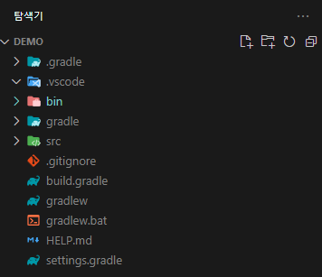
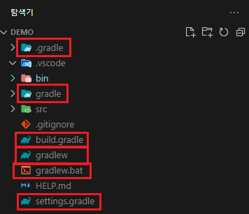
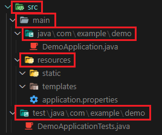
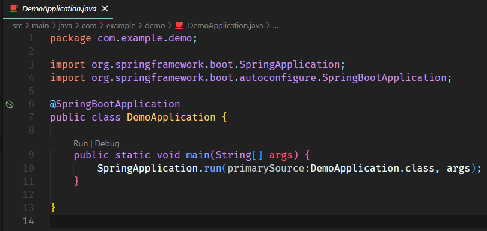
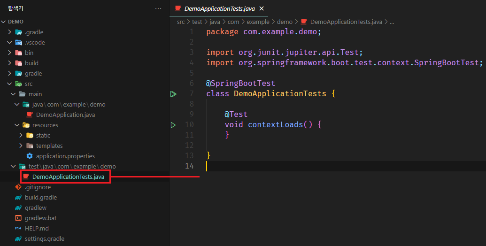

[뒤로가기](../../README.md) 

# 프로젝트 구조

### 프로젝트 예시는 SpringBoot_Repository/demo 프로젝트이다.

## 프로젝트 환경

1. [Visual Studio Code](https://code.visualstudio.com/)
2. VSCode Extension
   - Java Extension Pack
   - Spring Boot Extension Pack
3. JDK : [Red Hat OpenJDK 17.0.6.0](https://developers.redhat.com/products/openjdk/download#assembly-field-downloads-page-content-82031)
4. SpringBoot
   - Version : 2.7.14
   - Build : Gradle
   - Library : Spring Web

## 시작

 
자동으로 생성되는 프로젝트의 구조를 알아본다. 
프로젝트의 구조만을 설명하며 각 기능들에 대한 구체적인 설명은 생략한다. 

### 빌드 [Gradle]

 

.gradle : 프로젝트의 빌드 설정관 관련된 파일이 저장되어있다. 

---

gradle-wrapper.properties : gradle wrapper 방식의 구성 설정이 저장되는 파일이다.

---

gradle-wrapper.jar : Wrapper 파일이다. 
실행 스크립트 (gradlew)가 동작하면 wrapper에 맞는 환경을 로컬 캐시에 다운로드 받은 뒤에 실제 명령에 해당하는 task를 실행한다. 

---

gradlew는 gradle wrapper 방식으로 프로젝트의 컴파일 및 빌드를 진행할 수 있다.

gradlew : 윈도우용 gradle wrapper 실행 스크립트이다.

gradlew.bat : 유닉스용 gradle wrapper 실행 스크립트이다.

---

build.gradle : 프로젝트의 빌드 설정을 포함하며 실제로 빌드를 진행시 사용되는 Gradle 빌드 스크립트이다. 

---

settings.gradle : 프로젝트의 저장소 설정을 정의하고, 빌드시 포함해야하는 모듈을 Gradle에게 알려준다. 

---

### 소스 파일

 

src/main/java : 프로젝트에 사용되는 class, interface 파일이 저장되는 폴더이다.

DemoApplication.java : 실제 프로젝트를 실행하는 클래스 파일이다. 
 

> SpringApplication.run(DemoApplication.class, args);

DemoApplication.class : 프로젝트의 메인 클래스를 지정한다.

args : 프로젝트 실행 시 전달하고 싶은 커맨드 라인 인자를 나타내다.

---

src/main/resources : 자바 파일을 제외한 HTML, CSS, JavaScript, 환경 파일(application.properties)이 저장되는 폴더이다.

---

static : 프로젝트의 HTML, CSS, JS, 이미지 등의 정적 파일이 저장되는 공간이다. 
기본적인 정적 파일의 위치는 루트로 매핑된다. 

> http://localhost:8080/hello.html

---

templates : thymeleaf 템플릿 방식으로 자바 객체와 연동하는 HTML 파일을 저장하는 공간이다. 
하지만, 보통 static에 HTML파일을 저장해 사용한다. 

---

application.properties : 프로젝트의 환경을 설정한다. 

---

 

Springboot 테스트 클래스이다.
